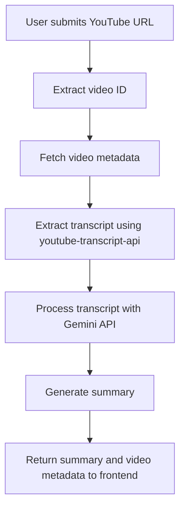
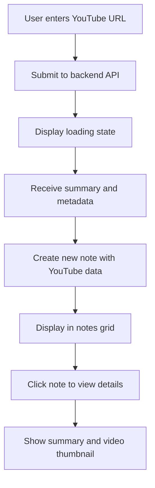
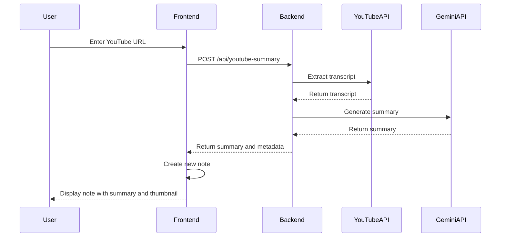

# YouTube Video Summarization Feature Plan

## Overview

This feature will allow users to input a YouTube URL, extract and summarize the video content, and save it as a note with a thumbnail preview.

The feature consists of two main components:

1. **AI Backend Enhancement**: Add functionality to extract YouTube video transcripts and generate summaries
2. **Frontend Enhancement**: Modify the existing notes page to support YouTube video summaries

## Detailed Implementation Plan

### 1. AI Backend Enhancement



#### 1.1 Create a new YouTube transcript extractor tool

Create a new Python module in the AI backend to handle YouTube video processing:

- **File**: `ai_backend/tools/youtube_processor.py`
- **Dependencies**: Add `youtube-transcript-api` to `requirements.txt`
- **Functionality**:
  - Extract video ID from YouTube URL
  - Fetch video metadata (title, thumbnail URL)
  - Extract transcript using youtube-transcript-api
  - Process transcript with Gemini API to generate a summary

#### 1.2 Add a new API endpoint

Extend the FastAPI backend to include a new endpoint for YouTube video summarization:

- **Endpoint**: `/api/youtube-summary`
- **Method**: POST
- **Request Body**: YouTube URL
- **Response**: Summary text, video title, thumbnail URL, and original URL
- **Integration**: Connect to the existing LLM infrastructure

### 2. Frontend Enhancement



#### 2.1 Enhance Note Type

Extend the existing Note type in `notes.tsx` to include YouTube-specific fields:

```typescript
type Note = {
  id: string;
  title: string;
  content: string;
  createdAt: Date;
  updatedAt: Date;
  // New fields for YouTube notes
  isYouTube?: boolean;
  youtubeUrl?: string;
  thumbnailUrl?: string;
};
```

#### 2.2 Add YouTube URL Input Form

Create a new dialog for YouTube URL input:

- Add a button to open the YouTube URL input dialog
- Create a form with validation for YouTube URLs
- Submit the URL to the backend API
- Show loading state during processing

#### 2.3 Enhance Note Display

Modify the note card component to handle YouTube notes:

- Display a YouTube icon or indicator for YouTube summary notes
- Show the video thumbnail in the note card
- Add a link to the original YouTube video
- Ensure the summary text is properly displayed

#### 2.4 Update Note Dialog

Enhance the note dialog to properly display YouTube content:

- Show the video thumbnail more prominently
- Include a link to watch the original video
- Display the AI-generated summary
- Allow editing of the summary if needed

## Technical Implementation Details

### Backend Implementation

1. **Install Dependencies**:
   ```bash
   pip install youtube-transcript-api
   ```

2. **YouTube Processor Implementation**:
   - Extract video ID using regex
   - Use youtube-transcript-api to fetch transcript
   - Concatenate transcript segments
   - Use Gemini API to summarize the transcript
   - Return structured data with summary and metadata

3. **API Endpoint Implementation**:
   - Create a new Pydantic model for YouTube requests
   - Implement error handling for invalid URLs or unavailable transcripts
   - Return properly formatted JSON response

### Frontend Implementation

1. **UI Components**:
   - YouTube URL input form
   - Enhanced note card with thumbnail support
   - Modified note dialog with YouTube-specific display

2. **State Management**:
   - Add YouTube-specific fields to note state
   - Handle loading states during API calls
   - Store YouTube metadata with notes

3. **API Integration**:
   - Create a new function to call the YouTube summary endpoint
   - Handle response data and errors
   - Update the notes state with the new YouTube summary note

## Data Flow



## Implementation Timeline

1. **Backend Development** (1-2 days):
   - Set up YouTube transcript extraction
   - Implement summary generation
   - Create and test new API endpoint

2. **Frontend Development** (2-3 days):
   - Enhance Note type and state management
   - Create YouTube URL input form
   - Update note display components
   - Integrate with backend API

3. **Testing and Refinement** (1 day):
   - Test with various YouTube videos
   - Refine summary quality
   - Optimize UI/UX

## Potential Challenges and Solutions

1. **Challenge**: Some YouTube videos may not have transcripts available.
   **Solution**: Implement proper error handling and user feedback.

2. **Challenge**: Long videos may have extensive transcripts that exceed token limits.
   **Solution**: Implement chunking to process large transcripts in segments.

3. **Challenge**: YouTube API rate limiting.
   **Solution**: Implement caching and rate limit handling.

4. **Challenge**: Ensuring good quality summaries for different types of content.
   **Solution**: Fine-tune the prompt to the Gemini API for better summarization.

## Future Enhancements

1. Add categorization of YouTube videos
2. Implement tagging for better organization
3. Add support for playlists
4. Enable sharing of summaries
5. Add speech-to-text for videos without transcripts